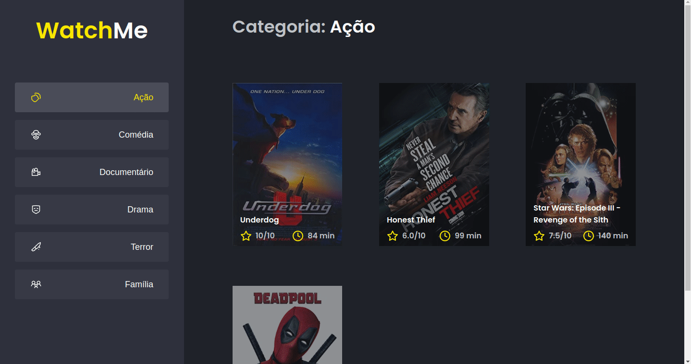

# better-watch-me

<h2 align="center">
  A frontend movies list. Built from scratch with ReactJS, Webpack, Babel, SASS 
  and Typescript.
</h2>

<p align="center">
  
  
  
  
  <a href="https://github.com/areasflavio/better-watch-me/commits/master">
    
  </a>
</p>

<p align="center">
  <a href="#star-features">Features</a>&nbsp;&nbsp;|&nbsp;&nbsp;
  <a href="#keyboard-technologies">Technologies</a>&nbsp;&nbsp;|&nbsp;&nbsp;
  <a href="#computer_mouse-installation">Installation</a>
</p>



<br/>

# :star: Features

[(Back to top)](#better-watch-me)

This is a frontend for a movies list.

Some key features are:

- Built from scratch with ReactJS.
- Create Webpack and Babel setup.
- Setup for CSS and SASS.
- Uses React concepts to improve performance.
- Fake API with JSON Server
- Written using Typescript.

> Project developed as a challenge for Chapter V of Rocketseat's Ignite bootcamp.

<br/>

# :keyboard: Technologies

[(Back to top)](#better-watch-me)

This is what I used and learned with this project:

- [x] ReactJS
- [x] React Memo
- [x] UseCallback
- [x] Webpack
- [x] Babel
- [x] CSS/SASS
- [x] React Icons
- [x] Axios
- [x] JSON-Server
- [x] Typescript

<br/>

# :computer_mouse: Installation

[(Back to top)](#better-watch-me)

To use this project, first you need NodeJS running in your device, then you can
follow the commands below:

```bash
# Clone this repository
git clone https://github.com/areasflavio/better-watch-me.git

# Go into the repository
cd better-watch-me

# Install dependencies for the application
yarn install

# To start the api server, run the following command
yarn server

# To start the development server, run the following command
yarn dev
```

# :man_technologist: Author

[(Back to top)](#better-watch-me)

Build by Flávio Arêas 👋 [Get in touch!](https://www.linkedin.com/in/areasflavio/)
